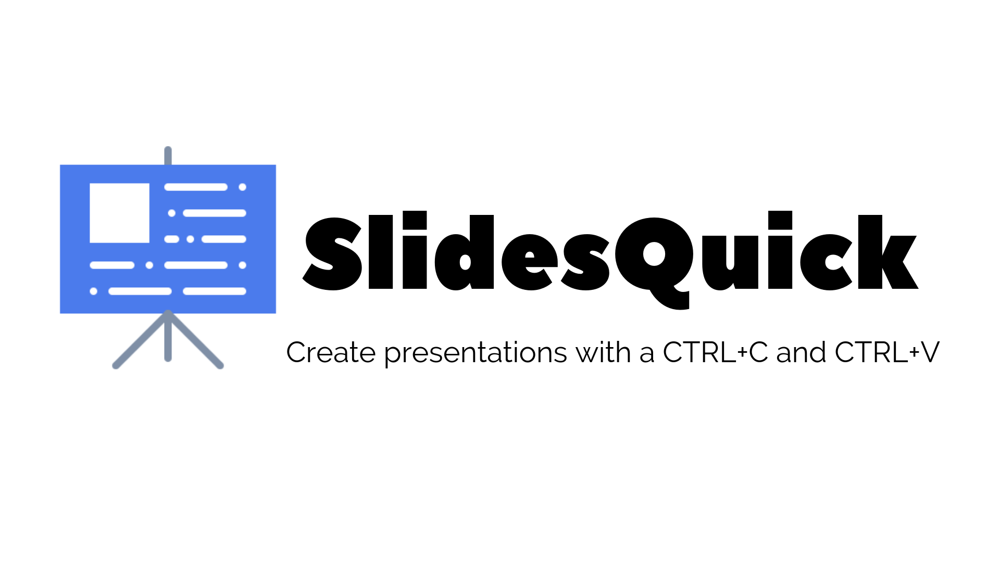
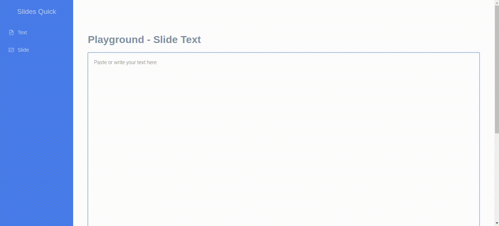
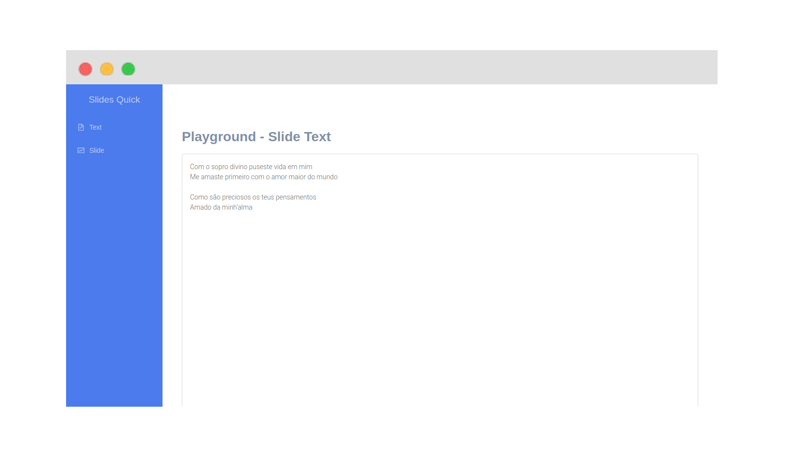
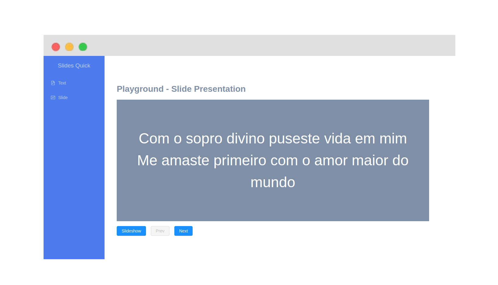

  

SlidesQuick is a application where you can create presentations quickly by just using CTRL+C and CTRL+V.

## **Features**

- Create slides from plain text;
- Open the presentation in full-screen;

## **New features coming soon!**

- Change the background colour in one click;
- Change the text size with an intuitive tool;
- Download the presentation in a pptx extension;

## **Running the project locally:**

- Clone this repository;
- Open the terminal in the project folder;
- Run `npm install` and `yarn start`;

## **License**

MIT (João Pedro Schmitz)
